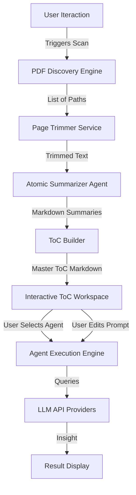

# Technical Specification: Automated PDF Discovery & Agentic Intelligence System

## 1. Executive Summary

### 1.1 Application Overview
This document defines the technical architecture and functional requirements for an **Automated PDF Discovery & Agentic Intelligence System**. This system is designed to act as an autonomous research assistant that lives within a file ecosystem. Its primary function is to recursively scan directory structures to identify PDF documents, intelligently process them by trimming irrelevant metadata (such as cover pages), generate high-level summaries for each document, and synthesize these findings into a master **Table of Contents (ToC)**.

Beyond simple summarization, the system transforms the ToC into an active workspace where users can deploy specialized AI Agents (defined in `agents.yaml`) to perform complex reasoning comparisons, trend analysis, or cross-document synthesis using state-of-the-art Large Language Models (LLMs) like Gemini and GPT-4.

### 1.2 Core Objectives
*   **Automated Discovery**: Recursively traverse local or uploaded directory structures to find all `.pdf` assets.
*   **Smart Trimming**: Automatically identify and remove the first page (often cover sheets or non-substantive metadata) to optimize context windows and relevance.
*   **Atomic Summarization**: Generate a concise Markdown summary for every individual PDF found.
*   **Holistic Synthesis (ToC)**: Aggregate all summaries into a structured "Table of Contents" document that serves as a knowledge map of the folder.
*   **Agentic Activation**: Enable users to run advanced agents against the consolidated ToC to extract specific insights across the entire document corpus.
*   **Secure & Accessible**: Deployable on Hugging Face Spaces via Streamlit, with robust API key management (OpenAI/Gemini).

---

## 2. System Architecture

### 2.1 Tech Stack Components
The solution utilizes a modern Python-based stack, optimized for stateless deployment on cloud container services.

*   **User Interface**: **Streamlit**. Provides a reactive, data-driven web interface for file browsing, progress tracking, and agent interaction.
*   **Core Logic**: Python 3.10+.
    *   **File System Operations**: `os` and `pathlib` for robust directory traversal.
    *   **PDF Manipulation**: `pypdf` (lightweight, fast) for page extraction and text decoding.
*   **AI Orchestration**:
    *   **LLM Gateway**: A unified controller interacting with **OpenAI** (GPT-4o-mini, GPT-4o) and **Google Gemini** (Gemini 2.5 Flash, 1.5 Pro).
    *   **Agent Configuration**: `agents.yaml` parsing to dynamically load agent personalities and prompt templates.
    *   **System Instructions**: `SKILL.md` ingestion to ground the model's behavior in specific operational protocols.
*   **Deployment**: **Hugging Face Spaces**.

### 2.2 Data Flow Pipeline


---

## 3. Module Specifications

### 3.1 Module 1: Recursive PDF Discovery Engine
This backend service is responsible for mapping the knowledge territory.

#### 3.1.1 Discovery Logic
*   **Input**: A root directory path (or uploaded zip file extracted to a temporary directory).
*   **Operation**: The system performs a strictly recursive scan (`os.walk` or similar) to locate every file ending in `.pdf` (case-insensitive).
*   **Output**: A list of absolute file paths to valid PDF documents.
*   **UI Feedback**: A progress bar or status indicator showing "Found X PDFs..." to the user in real-time.

### 3.2 Module 2: Intelligent Trimming Service
To ensure the AI focuses on content rather than administrative headers.

#### 3.2.1 Trimming Rules
*   **Constraint**: The requirement specifies trimming the **first page** of each PDF.
*   **Implementation**:
    *   Load PDF using `pypdf.PdfReader`.
    *   Check page count.
        *   If count > 1: Discard Page 0, extract text from Page 1 to End.
        *   If count == 1: Keep Page 0 (to avoid data loss), but flag as "Single Page Document".
*   **Text Extraction**: Extract raw text from the kept pages. If `pypdf` yields empty text (scanned image), the system falls back to a placeholder message "[Scanned content - Text unavailable without OCR]" (unless OCR module from Task 1 is shared/enabled, but strictly per this spec, we assume extraction).

### 3.3 Module 3: Atomic Summarization (The "Indexer")
This module converts raw text into a digestible index.

#### 3.3.1 Summary Generation
*   **Process**: For each trimmed text blob, the system calls a fast, efficient LLM (e.g., `gemini-2.5-flash` or `gpt-4o-mini`).
*   **Prompt**: "Summarize the following medical device/regulatory document in 3-5 concise bullet points. Focus on the device name, intended use, and key performance data."
*   **Output Format**: A Markdown file named `{original_filename}.md`.
*   **Storage**: These individual `.md` summaries are saved in a temporary `processed_summaries/` directory, mirroring the structure of the input source if possible, or flat-listed.

### 3.4 Module 4: Table of Contents (ToC) Synthesis
The central nervous system of the application.

#### 3.4.1 ToC Construction
*   **Aggregation**: The system reads all generated `{original_filename}.md` files.
*   **Formatting**: It compiles them into a single Master Markdown document (`ToC_Master.md`).
*   **Structure**:
    ```markdown
    # Master Table of Contents

    ## 1. [Filename A]
    *   Summary point 1
    *   Summary point 2

    ## 2. [Filename B]
    *   Summary point 1
    ...
    ```
*   **Interactivity**: This generated Markdown is displayed in an editable text area in the Streamlit UI.

### 3.5 Module 5: Agentic Execution Workspace
This is where the user leverages the pre-computed index to do work.

#### 3.5.1 Context Loading
The "Active Context" for this workspace is **solely the ToC Document** generated in Module 4. This is a crucial design decision for efficiency: instead of re-reading gigabytes of PDFs for every query, the agents reason over the high-level summaries (the "Map").

#### 3.5.2 Agent Selection
*   **Integration**: The UI parses `agents.yaml` to populate a dropdown menu.
*   **Filtering**: Users can select agents designed for "Synthesis", "Comparison", or "Gap Analysis".
*   **Example Agents**:
    *   *Trend Spotter*: "Read the ToC and identify common indications for use across all devices."
    *   *Competitor Analyst*: "List all manufacturers mentioned in the summaries."

#### 3.5.3 Prompt Customization
*   **Default Behavior**: When an agent is selected, its `user_prompt_template` is loaded into a text area.
*   **Override**: The user can modify this prompt. For example, changing "Summarize insights" to "Specifically list all clinical trial sample sizes mentioned."
*   **Model Selection**: Per-run model selection (Gemini vs. OpenAI) ensures users can balance cost vs. reasoning power (e.g., using `gpt-4o` for complex reasoning on the ToC).

---

## 4. User Interface Design (Streamlit)

### 4.1 Layout Strategy
The application follows a linear, "Pipeline-style" layout to guide the user through the process.

*   **Header**: Application Title & API Status indicators.
*   **Section 1: Source Discovery**
    *   Button: "Scan Directory" (or "Upload Folder").
    *   Display: Metrics card showing "PDFs Found: [N]".
*   **Section 2: Processing Status**
    *   Progress Bar: "Trimming & Summarizing... [45%]"
    *   Log: Expandable log showing "Processed file A... Done", "Processed file B... Done".
*   **Section 3: The Knowledge Map (ToC)**
    *   Large Text Area: Displays the generated ToC Markdown.
    *   Action: "Edit Manually" toggle (allows user to fix typos in the summary).
*   **Section 4: Agent Command Center**
    *   Dropdown: "Select Agent".
    *   Parameters: Model Selector, Temperature Slider.
    *   Input: Prompt Editor (pre-filled with Agent template).
    *   Button: "Run Agent on ToC".
*   **Section 5: Results**
    *   Markdown Viewer: Displays the agent's final output.
    *   Download Button: "Download Report".

### 4.2 Configuration Sidebar
*   **API Keys**: Masked input fields for OpenAI and Gemini keys.
*   **Advanced Settings**:
    *   "Max Summary Length": Slider to control how detailed the atomic summaries are.
    *   "Trimming Toggle": Option to disable "First Page Trim" if needed.
    *   "Agents Config": Uploader for custom `agents.yaml`.

---

## 5. Security & Configuration Standards

### 5.1 API Key Handling
*   **Logic**:
    1.  Check `os.environ` for `OPENAI_API_KEY` or `GEMINI_API_KEY`.
    2.  If found -> Use silently, hide input fields in UI (or show "Connected").
    3.  If not found -> Show text input fields in Sidebar.
*   **Session State**: Keys are stored in `st.session_state` only. They are purged on page refresh.

### 5.2 Deployment Compatibility
The app must be container-ready for Hugging Face Spaces.
*   **Port**: 8501 (Streamlit default).
*   **File Permissions**: The app needs write access to a temporary directory (`/tmp` or similar) to save the intermediate Markdown summaries before compilation.
*   **Memory Management**: Since it processes files sequentially (or in small batches), memory footprint remains low, suitable for free-tier Spaces.

---

## 6. Functional Scenarios / Use Cases

### 6.1 Scenario A: The Regulatory Landscape Survey
*   **User Goal**: Understand the landscape of "Catheter" devices in a folder of 50 past applications.
*   **Flow**:
    1.  User points system to `data/catheters`.
    2.  System scans 50 PDFs.
    3.  System trims headers, summaries each.
    4.  System identifies 1 file is a single page image, marks it in log.
    5.  User sees the "ToC" listing 50 summaries.
    6.  User selects "Compare & Contrast Agent" from `agents.yaml`.
    7.  Agent reads the ToC and outputs: "Most devices use Material X, while 20% use Material Y."

### 6.2 Scenario B: The "Lost Document" Search
*   **User Goal**: Find which document mentioned "Clinical Study ISO 14155".
*   **Flow**:
    1.  System indexes the folder.
    2.  User selects a "Search Agent" (or generic prompt).
    3.  User Prompt: "Which document in the ToC mentions ISO 14155?"
    4.  Agent scans the summaries and replies: "Document #14 and #32 summaries mention adherence to ISO 14155."

---

## 7. Implementation Roadmap

### 7.1 Phase 1: File System & Trimming Logic
*   Implement `find_pdfs(directory)` function.
*   Implement `trim_first_page(pdf_path)` function using `pypdf`.

### 7.2 Phase 2: Batch Processing Loop
*   Create the loop that iterates through the discovered list.
*   Integrate the LLM call (`summarize_text`) inside the loop.
*   Add error handling (corrupt PDF, 0 pages, etc.).

### 7.3 Phase 3: ToC Synthesis & UI Integration
*   Build the Markdown concatenation logic.
*   Wire up the Streamlit interface to trigger these underlying functions.

### 7.4 Phase 4: Agent Execution Layer
*   Reuse the `call_llm` and `agent_run_ui` logic from the Task 1 `app.py` (since this is an extension of the same ecosystem).
*   Ensure the "Input" for the agent is strictly the "ToC Content".

---

*(End of Specification)*
